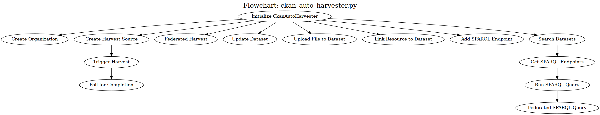

## Best Practice Workflow for Dataset
This best practice does not affect our ckan-dcat process automation. However, it will ensure that our ckan-dcat harvesting (including automated) will collect metadata.

### 1. Generate RDF metadata (DCAT-compliant) for each dataset.
Example (Turtle format):
```turtle
@prefix dcat: <http://www.w3.org/ns/dcat#> .
@prefix dct: <http://purl.org/dc/terms/> .
@prefix foaf: <http://xmlns.com/foaf/0.1/> .

<https://example.org/dataset/climate-data>
    a dcat:Dataset ;
    dct:title "Climate Change Observations" ;
    dct:description "Daily temperature, rainfall, and CO2 levels." ;
    dct:identifier "climate-data-2025" ;
    dct:publisher [ a foaf:Organization ; foaf:name "Enviro Research Lab" ] ;
    dcat:distribution [
        a dcat:Distribution ;
        dcat:accessURL <https://example.org/data/climate.csv> ;
        dct:format "CSV"
    ] .
```

### 2. Expose/Publish metadata via SPARQL endpoint or DCAT RDF file
Provide a SPARQL endpoint (Blazegraph, Virtuoso, Fuseki, etc.) with queries that return DCAT-compliant RDF. Example query to expose datasets:
```sparql
PREFIX dcat: <http://www.w3.org/ns/dcat#>
CONSTRUCT {
    ?dataset ?p ?o .
    ?dist ?dp ?do .
}
WHERE {
    ?dataset a dcat:Dataset ;
             ?p ?o .
    OPTIONAL {
        ?dataset dcat:distribution ?dist .
        ?dist ?dp ?do .
    }
}
```
Or publish a DCAT RDF file (catalog.ttl, catalog.rdf) at a stable URL. This is called a DCAT catalog feed, and CKAN harvesters can directly fetch it.

### 3. Ensure Metadata is Accessible in Multiple Serializations in Turtle, RDF/XML, or JSON-LD
Expose the same catalog with content negotiation:
```vbnet
Accept: text/turtle
Accept: application/ld+json
Accept: application/rdf+xml
```

### 4. Provide stable URIs for datasets/distributions.
   - Each dataset should have a persistent URI (e.g., https://example.org/dataset/<id>).
   - Distributions should also have stable URIs (.../dataset/<id>/distribution/<version>).
   - Avoid blank nodes for datasets or distributions (harvesters often skip them).

### 5. Validate with DCAT Tools
   - Use DCAT validators to check compliance.
   - Ensure your catalog passes DCAT-RDF requirements if targeting EU/INSPIRE or Open Data portals.

---

## Metadata Harvesting
- Create Organization as Data Owner (CLI: python ckanctl.py create-org --name <name> --title <title> --description <description>)
- Create Harvest Source (CLI: python ckanctl.py create-harvest --name <name> --url <url> --source-type <source-type> --owner-org <organization> [--title <title> --frequency <frequency> --notes <notes>])
- Trigger Harvest (CLI: python ckanctl.py trigger-harvest --source <source_id>)

It will automatically produces many datasets.

## Granular Class Components


### FUNCTION create_org(name, title, description):
      request_data ← { "name": name, ["title": title, "description": description]}
      response ← POST to ckan_base_url  + "/api/3/action/organization_create" with request_data
      RETURN response (success/failure)

-----------------------------------------------------
### FUNCTION register_harvest(name, title, url, owner_org, source_type, frequency, title, notes):
      request_data ← { "name": name, "title": title, "url": url, "owner_org":owner_org,
                        ["source_type": type, "frequency": frequency, "title":title, "notes":notes]}
      response ← POST to ckan_base_url  + "/api/3/action/harvest_source_create" with request_data
      RETURN response (success/failure)

-----------------------------------------------------
### FUNCTION resolve_source_id(source_identifier):
      request_data ← { "source_identifier": source_identifier}
      response ← GET to ckan_base_url  + "/api/3/action/harvest_source_show" with request_data
      RETURN UUID 

-----------------------------------------------------
### FUNCTION trigger_harvest(source_id):
      source_uuid ← resolve_source_id(source_id)
      request_data ← { "source_id": source_uuid }
      response ← POST to ckan_base_url  + "/api/3/action/harvest_jobs_create" with request_data
      RETURN harvest_job_id from response

-----------------------------------------------------
### FUNCTION update_dataset(dataset_id, updates: dict):
      updates["id"] ← dataset_id
      response ← POST to ckan_base_url  + "/api/3/action/package_update" with updates
      RETURN response (success/failure)

-----------------------------------------------------
### FUNCTION upload_file_to_dataset(dataset_id, file_path):
      Open file at file_path
      request_data ← { "id": dataset_id, "upload": file_content }
      response ← POST to ckan_base_url  + "/api/3/action/resource_create" with request_data
      RETURN response

-----------------------------------------------------
### FUNCTION load_sample_link(dataset_id, resource_url, format="CSV"):
      request_data ← { "id": dataset_id, "extras":{"url": url}}
      response ← POST to ckan_base_url  + "/api/3/action/resource_create" with request_data
      RETURN response

-----------------------------------------------------
### FUNCTION add_sparql_endpoint(dataset_id, endpoint):
      request_data ← { "id": dataset_ide,
                        "extras": {"key": "dcat:accessURL", "value": endpoint} }
      response ← POST to ckan_base_url  + "/api/3/action/package_patch" with request_data
      RETURN response

-----------------------------------------------------
### FUNCTION run_sparql_query(endpoint_url, query_file):
      query_text ← read contents of query_file
      response ← POST endpoint_url with SPARQL query_text
      RETURN query results

